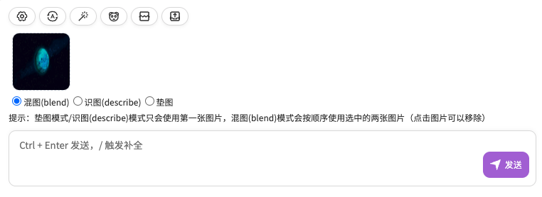

<div align="center">

<h1 align="center">🍭 ChatGPT-Pro</h1>

Based on [ChatGPT-Next-Web](https://github.com/Yidadaa/ChatGPT-Next-Web) + [ChatGPT-Midjourney](https://github.com/Licoy/ChatGPT-Midjourney), this project has been extended to include features such as registration, email login, QR code login, membership management, mask management, and Stable Diffusion (SD) image generation.

[QQ Group Chat](https://gitee.com/981743898/ChatGPT-PRO/issues/I7VUZB) | [💥Demo Site](https://ai.codeok.cn)


### Final Output Showcase


</div>

## Feature List
- [x] All original features from ChatGPT-Next-Web
- [x] Midjourney Imagine — Generate images from prompts
- [x] Midjourney Upscale — Upscale generated images
- [x] Midjourney Variation — Create image variations
- [x] Midjourney Describe — Describe images using AI
- [x] Midjourney Blend — Blend multiple images
- [x] Midjourney Image Prompt — Use an image as prompt base
- [x] Drawing progress percentage and real-time image display
- [x] User registration
- [x] Email login
- [ ] QR code login
- [ ] Integration with Stable Diffusion image generation
- [ ] Mask management
- [ ] Membership management
- [ ] Invitation code system

## Parameter Description
### MIDJOURNEY_PROXY_URL
```shell
MIDJOURNEY_PROXY_URL=http://yourip:port
```
> ⚠️Note: If you are deploying with Docker, the address here should be http://public_IP:port instead of http://localhost:port because containers in Docker are isolated, and localhost refers to the container’s internal address, not the host machine’s address.

- In the interface


### MIDJOURNEY_PROXY_API_SECRET
(Optional) The API request key for midjourney-proxy to prevent unauthorized use; it can be configured in the environment variables.

### CODE
(Optional) Set an access password for the settings page to prevent others from easily using and consuming your balance.


#### Manual Deployment
- Clone this project to your local machine
- Install dependencies
```shell
npm install
npm run build
npm run start // #Or start in development mode： npm run dev
```
### midjourney-proxy Service Deployment

#### Docker
- Run midjourney-proxy (Midjourney API service). For more parameter configurations, please refer to：[midjourney-proxy](https://github.com/novicezk/midjourney-proxy))
```shell
docker run -d --name midjourney-proxy \
 -p 8080:8080 \
 -e mj.discord.guild-id=xxx \
 -e mj.discord.channel-id=xxx \
 -e mj.discord.user-token=xxx \
 --restart=always \
 novicezk/midjourney-proxy:2.4
```
#### Railway
> Railway is a platform that offers flexible deployment solutions, with servers located overseas, making it convenient for calling MidJourney.

Reference: \[midjourney-proxy - Railway Deployment Guide](https://github.com/novicezk/midjourney-proxy/blob/main/docs/railway-start.md)

#### Zeabur 
> - Newly registered GitHub accounts may not be able to use Railway, but they can use Zeabur.
> - Projects deployed via Railway automatically get a domain name; however, domains like *.up.railway.app are inaccessible within China due to certain restrictions.
> - eabur’s servers are located overseas, and its generated domains like *.zeabur.app are not blocked, so they can be accessed directly within China.

[](https://dash.zeabur.com/templates/B04F4M)

Reference: [midjourney-proxy - Zeabur Deployment Guide](https://github.com/novicezk/midjourney-proxy/blob/main/docs/zeabur-start.md)

## Usage
Enter your drawing description starting with /mj in the input box to create an image, for example:
```
/mj a dog
```
### Blend Images, Describe Images, Image Prompting

> Note:
In Image Prompting and Describe modes, only the first image is used.
In Blend mode, the selected two images are used in order (click an image to remove it).

## Screenshots
### Blend, Describe, and Image Prompt Modes

### Real-time Status Updates

### Custom Midjourney Parameters

### More Features
- Waiting for you to discover on your own

## Acknowledgments 
- [ChatGPT-Next-Web](https://github.com/Yidadaa/ChatGPT-Next-Web)
- [midjourney-proxy](https://github.com/novicezk/midjourney-proxy)
- [ChatGPT-Midjourney](https://github.com/Licoy/ChatGPT-Midjourney)
## Open Source License
[Anti 996 LICENSE](./LICENSE)
